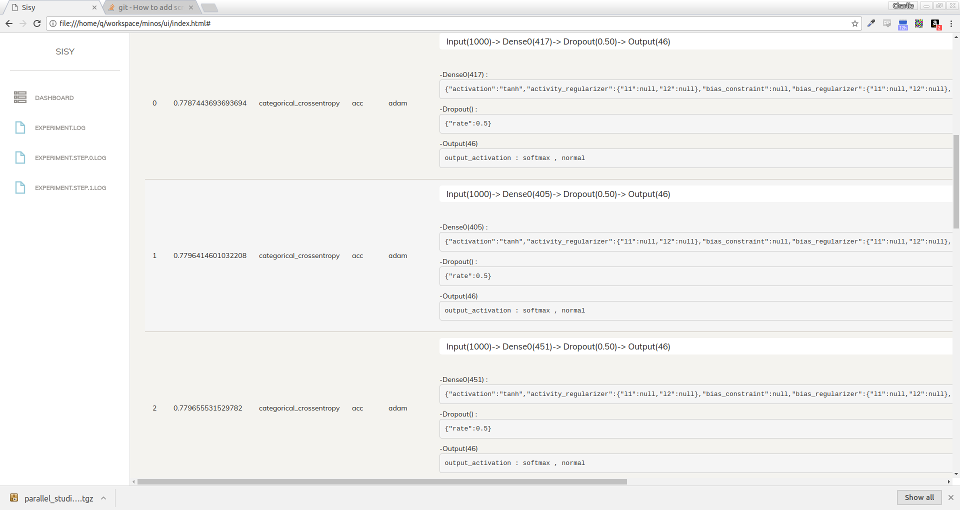

# Sisy<sub><sup>phus</sup></sub>


#### Install sisy:
 ```
 pip install pysisy==0.13
 ```


Using [Minos](https://github.com/guybedo/minos) to do the heavy lifting, Sisy uses [genetic algorithms](https://github.com/deap/deap) to find the best topology and hyper parameters for your keras neural networks.


## Examples

The  [examples](https://github.com/qorrect/sisy/tree/master/examples) directory tries to mimic [the keras examples](https://github.com/fchollet/keras/blob/master/examples/) with added parameter searches.

This is based on [reuters_mlp.py](https://github.com/fchollet/keras/blob/master/examples/reuters_mlp.py) from keras examples.

```python
          # Our Input size is the number of words in our reuters data we want to examine
layout = [('Input', {'units': 10000}),
          # 'units' below, we specify a range of nodes we want to try
          # 'activation' we specify a list of the activation types we want to try
          ('Dense', {'units': range(400, 600), 'activation': ['relu','tanh']}),
          # 'rate' is a f(loat)range from 0.2 to 0.8 , forced into a list
          ('Dropout', {'rate': list(frange(0.2,0.8))}),
          ('Output', {'units': 42, 'activation': 'softmax'})]

run_sisy_experiment(layout, 'sisy_reuters_mlp', (x_train, y_train), (x_test, y_test),
                    optimizer='adam',
                    metric='acc',
                    epochs=10,
                    batch_size=32,
                    n_jobs=8,
                    # 'devices' : Lets run this on the gpus 0 and 1
                    devices=['/gpu:0','/gpu:1'],
                    # 'population_size' : The number of different blueprints to try per generation.
                    population_size=10,
                    # 'generations' : The number of times to evolve the population
                    # ( evolving here means taking the best blueprints and
                    # combining them to create ${population_size} more new blueprints)
                    generations=10,
                    loss='categorical_crossentropy',
                    # 'shuffle' : Defaults to true
                    shuffle=False)

```

Which will produce log files that are viewable with the UI.

```python
python -m sisy
```

Will open Sisy log viewer in your browser





The end result is an optimal network you can load with ```sisy_load_model("your_experiment_label")```
